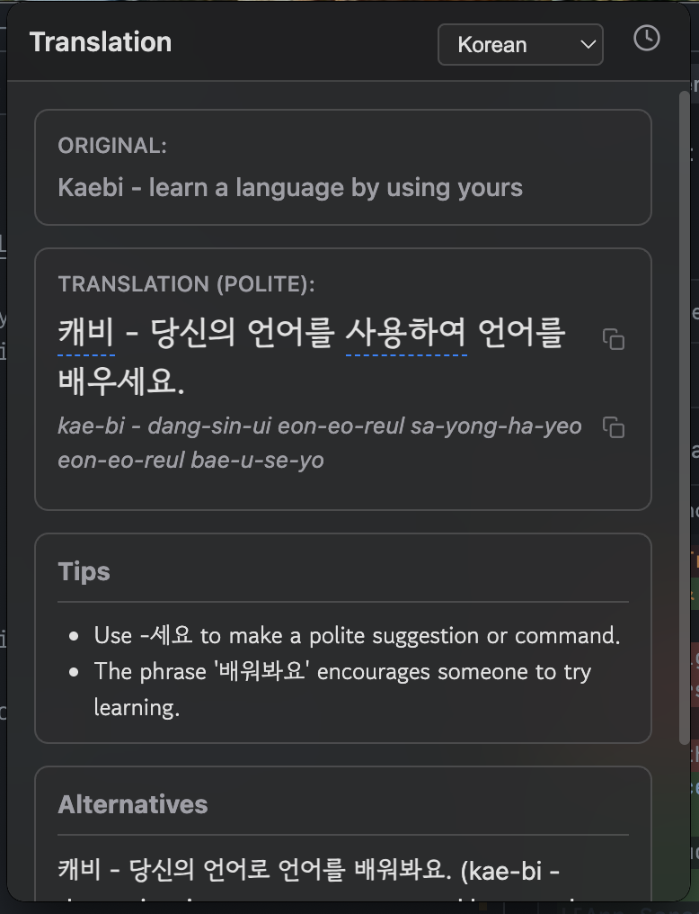

# Kaebi - learn a language by using yours

[](LICENSE.md)

_(Kaebi is short for Dokkaebi 도깨비, mischievous spirits from Korean folklore known for their ability to transform and interact with humans - fitting for a language learning companion!)_

A sleek macOS menu bar application providing instant translations of your clipboard content to **Korean** or **Malayalam** (extensible with more language packs). Built with Electron, TypeScript, Bun, and the Google Gemini API.


_(Replace with an actual screenshot)_

## ✨ Features

- **Menu Bar Access**: Quickly access translations via the menu bar (icon pending) or a global keyboard shortcut.
- **Clipboard Monitoring**: Automatically translates text copied to your clipboard when the app window is opened.
- **Multi-Language Support**: Easily switch between Korean (`ko`) and Malayalam (`ml`) translations.
- **Structured Output**: Displays:
  - Main translation with formality level.
  - Romanized pronunciation.
  - Hoverable word breakdown (original word, type, pronunciation, notes).
  - Cultural/usage tips.
  - Alternative translations.
- **Gemini Powered**: Utilizes the `gemini-2.0-flash` model for fast and detailed translations via few-shot prompting.
- **Copy Functionality**: Convenient buttons to copy the translation or pronunciation.
- **Translation History**: Stores recent translations locally, accessible via a history view.
- **Dark Mode & Vibrancy**: Features a macOS-style dark theme with a frosted glass effect.
- **Persistent Settings**: Remembers your last selected language across restarts.
- **Custom Fonts**: Uses "Gowun Dodum" for Korean text for better readability.

## 🚀 Getting Started

### Prerequisites

- [Node.js](https://nodejs.org/) (which includes npm)
- [Bun](https://bun.sh/) (`npm install -g bun`)
- [Git](https://git-scm.com/)
- A [Google Gemini API Key](https://aistudio.google.com/app/apikey)

### Installation

1.  **Clone the repository:**

    ```bash
    git clone git@github.com:hrishioa/kaebi.git # Replace with your repo URL
    cd kaebi
    ```

2.  **Install Dependencies:**

    ```bash
    bun install
    ```

3.  **Set up Environment Variables:**

    - Copy the example environment file:
      ```bash
      cp .env.example .env
      ```
    - Edit the new `.env` file and add your Google Gemini API Key:
      ```
      GEMINI_API_KEY="YOUR_ACTUAL_API_KEY"
      ```

4.  **(Recommended) Add Icons:**
    - **Menu Bar Icon:** Replace the placeholder `assets/iconTemplate.png` with a valid **template image** (small, square, black and transparent PNG, e.g., 22x22 or 44x44 pixels). This is crucial for the menu bar icon to display correctly on macOS.
    - **App Icons (for packaging):** For building distributable apps, create and place appropriate icons in the `assets/` folder:
      - macOS: `icon.icns`
      - Windows: `icon.ico`
      - Linux: `icon.png` (e.g., 512x512)
        _(Ensure filenames match those in `package.json` under the `build` section)_

### Running the App

1.  **Build the application:**

    ```bash
    bun run build
    ```

    _(This compiles TypeScript to JavaScript in the `dist` folder)_

2.  **Start the Electron app:**
    ```bash
    electron ./dist/main/main.js
    ```
    _(Alternatively, use `bun run start` which combines build and run)_

## 使い方 (How to Use)

1.  **Open the App:** Run the application using the steps above.
2.  **Show the Window:** Use the global keyboard shortcut **Cmd+Shift+T** (or **Ctrl+Shift+T** on Windows/Linux if configured) to show/hide the translator window. _(Note: The menu bar icon functionality is currently dependent on replacing the placeholder icon file.)_
3.  **Copy Text:** Copy any text you want to translate to your clipboard (Cmd+C / Ctrl+C).
4.  **Trigger Translation:** Show the translator window (using the shortcut). It will automatically detect the clipboard content and start translating.
5.  **Explore Results:**
    - View the original text and the translation (with formality level).
    - See the romanized pronunciation.
    - Hover over underlined words in the translation to see their original meaning, type, pronunciation, and notes.
    - Copy the translation or pronunciation using the copy buttons (❐).
    - Read any Tips or Alternatives provided.
6.  **Switch Language:** Use the dropdown menu in the header to switch between Korean and Malayalam. The translation will automatically update for the text currently displayed.
7.  **View History:** Click the clock icon (🕒) in the header to view past translations. Click the reload icon (🔄) on an entry to view its details again. Use the trash icon (🗑️) to clear history, or the back arrow (←) to return.
8.  **Hide Window:** Click outside the window or use the Cmd+Shift+T shortcut again.

## 🛠️ Development

- **Build:** `bun run build`
- **Run (after build):** `electron ./dist/main/main.js`
- **Build & Run:** `bun run start`
- **Watch Mode (Requires `concurrently`):**
  ```bash
  bun add -d concurrently
  bun run watch # Builds initially and watches for changes
  # In another terminal:
  electron ./dist/main/main.js
  ```

## 📦 Building for Distribution

- **Package (Unpackaged app for testing):**

  ```bash
  bun run pack
  ```

  _(Output in `release/` directory)_

- **Distribute (Installer/Package):**
  ```bash
  bun run dist
  ```
  _(Creates `.dmg`, `.exe`, `.AppImage`, etc. in `release/` based on your OS)_

## 🏗️ Project Structure

```
kaebi/
├── assets/               # Icons (iconTemplate.png, icon.icns, etc.)
├── dist/                 # Compiled JavaScript output
├── release/              # Packaged application output
├── src/
│   ├── main/             # Electron Main Process
│   │   ├── main.ts
│   │   ├── translator.ts
│   │   ├── history-manager.ts
│   │   ├── language-configs.ts # Language prompts & examples
│   │   └── preload.ts
│   ├── renderer/         # Electron Renderer Process (UI)
│   │   ├── index.html
│   │   ├── styles/
│   │   │   ├── main.css
│   │   │   └── markdown.css
│   │   └── scripts/
│   │       └── renderer.ts
│   └── shared/           # Shared types/utils (currently basic)
├── .env                  # Local environment variables (ignored by git)
├── .env.example          # Example environment variables
├── .gitignore
├── bun.lockb
├── LICENSE.md            # (Add an MIT License file)
├── package.json
├── README.md             # This file
└── tsconfig.json
```

## 🔮 Future Improvements / Known Issues

- **Menu Bar Icon:** Requires replacing `assets/iconTemplate.png` with a valid macOS template image for the icon to appear and function correctly.
- **History Language:** History entries currently don't store the language they were translated _to_. Reloading history uses the _currently selected_ language.
- **Error Handling:** More user-friendly error display (e.g., specific API errors).
- **Add More Languages:** Easily extensible by adding new `LanguageConfig` objects to `language-configs.ts`.
- **Refine Tooltips:** Implement richer, custom tooltips instead of the basic browser `title` attribute.
- **Streaming:** Implement response streaming for faster perceived translation speed.

##📄 License

This project is licensed under the MIT License. See the [LICENSE.md](LICENSE.md) file for details.
